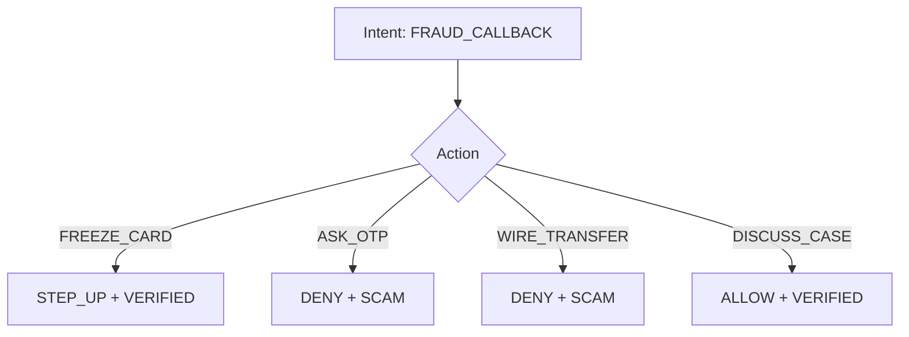

# Schéma logique

```mermaid
flowchart TD
  A[Intent: FRAUD_CALLBACK] --> B{Action}
  B -->|FREEZE_CARD| C[STEP_UP + VERIFIED]
  B -->|ASK_OTP| D[DENY + SCAM]
  B -->|WIRE_TRANSFER| E[DENY + SCAM]
  B -->|DISCUSS_CASE| F[ALLOW + VERIFIED]
```
